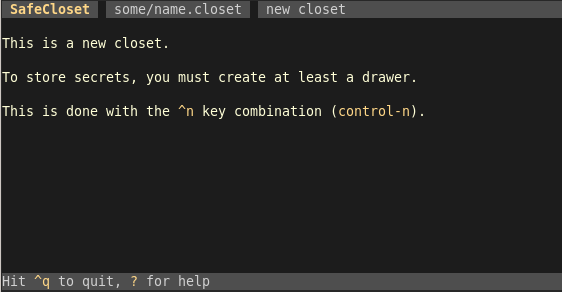
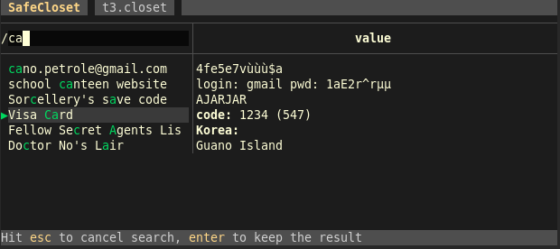

Be sure to read first the [usage overview](../#usage-overview) section: it may already contain the answer you need.

# Keys

Key | Action
:-:|-
<kbd>?</kbd> | Open the help screen
<kbd>ctrl</kbd><kbd>n</kbd> | Create a drawer (in the open drawer, or at root when none is open)
<kbd>ctrl</kbd><kbd>o</kbd> | Open a drawer
<kbd>ctrl</kbd><kbd>u</kbd> | Close the current drawer, without saving (you're back in the upper level one if you close a deep drawer)
<kbd>ctrl</kbd><kbd>s</kbd> | Save the current drawer and all upper drawers
<kbd>ctrl</kbd><kbd>q</kbd> | Quit without saving (with no confirmation)
<kbd>ctrl</kbd><kbd>h</kbd> | Toggle hidding password chars or unselected values
<kbd>ctrl</kbd><kbd>a</kbd> | Toggle opening all values or just the selected one
<kbd>/</kbd> | Start searching the current drawer. Do <kbd>enter</kbd> or use the down or up arrow key to freeze it. Do <kbd>esc</kbd> to cancel the search
<kbd>/</kbd> then <kbd>esc</kbd> | Remove the current filtering
<kbd>esc</kbd> | Cancel current field edition
<kbd>tab</kbd> | Create a new entry or edit the value if you're already editing an entry's name
arrow keys | Move selection, selecting either an entry name or a value (or move the cursor when in an input field)
<kbd>i</kbd> or <kbd>insert</kbd> | Start editing the selected name or value
<kbd>d</kbd> | Remove the selected entry (with confirmation)
<kbd>Enter</kbd> | Validate the current edition
<kbd>alt</kbd><kbd>Enter</kbd> or <kbd>ctrl</kbd><kbd>Enter</kbd>| New line in the currently edited value
<kbd>ctrl</kbd><kbd>c</kbd> | Copy
<kbd>ctrl</kbd><kbd>x</kbd> | Cut
<kbd>ctrl</kbd><kbd>v</kbd> | Paste

Note that single key shortcuts can't be used when in an input field. To leave an input field, hit <kbd>esc</kbd>.

# Launch

SafeCloset is always launched with the path to the closet file to create or open as argument:


```bash
safecloset my/secrets.closet
```

## Alias and --open

You may find convenient to have a shortcut to open your most common closet.

For example, you may have this in your shell configuration:

```bash
function xx {
	safecloset -o ~/my/secrets.closet
}
```

Creating drawers isn't something you frequently do, hence the `--open` option (`-o` in short) which skips the first screen.

# Most typical sessions

SafeCloset is designed for fast sessions. Here are three examples of standard usage.

## Find and read an entry

- open the usual closet (probably with `-o`)
- type the passphrase and hit <kbd>enter</kbd> to open the drawer
- hit <kbd>/</kbd> then a few letters to find your entry and see its value

If the value is multiline, you may have to select it to read it entirely:

- hit <kbd>enter</kbd> to freeze the search
- navigate with the arrow keys to the desired value, it automatically opens

You don't have to bother closing SafeCloset as it will automatically close after 60 seconds.

## Create an entry

- open the usual closet (with `-o`)
- type the passphrase and hit <kbd>enter</kbd> to open the drawer
- Hit <kbd>n</kbd> and fill the input with the entry name
- hit <kbd>tab</kbd> to go to the value input, and fill it
- validate the value with <kbd>enter</kbd>
- maybe move the entry with <kbd>ctrl</kbd><kbd>up</kbd>
- hit <kbd>ctrl</kbd><kbd>s</kbd> then <kbd>ctrl</kbd><kbd>q</kbd> to save and quit

## Edit an entry's value

- open the usual closet (probably with `-o`)
- type the passphrase and hit <kbd>enter</kbd> to open the drawer
- hit <kbd>/</kbd> then a few letters to find your entry
- hit the right arrow key to select the value
- hit <kbd>a</kbd> to edit the field (hit <kbd>i</kbd> if you prefer to have the cursor on start)
- edit the field, then hit <kbd>enter</kbd> to validate the change
- hit <kbd>ctrl</kbd><kbd>s</kbd> then <kbd>ctrl</kbd><kbd>q</kbd> to save and quit

# Create a drawer

## Shallow drawer

A "shallow" drawer is one which can be open from the top of the closet, with its own password.

To create a deep drawer, from the initial screen you get at closet creation or opening, hit <kbd>ctrl</kbd><kbd>n</kbd>, type the passphrase, then hit <kbd>enter</kbd>.




## Deep drawer

If you're a secret agent expecting to be tortured any day, you may be bothered by the fact an attacker having all the versions of the closet file can determine how many shallow drawers you're really editing.

A deep drawer is hidden inside another drawer, and it's not possible to know whether you edited a parent or a deeper drawer.

The downside of deep drawers is that you need to open the parent before you open the deeper drawer, which means typing two (or more) passphrases.

In most cases, you don't need such level of secrecy. Most users should be happy with one or a few shallow drawers.

To create a deep drawer, first open the parent drawer, then hit <kbd>ctrl</kbd><kbd>n</kbd>, type the passphrase, then hit <kbd>enter</kbd>.

# Open a drawer

Hit <kbd>ctrl</kbd><kbd>o</kbd>, type the passphrase, then hit <kbd>enter</kbd>.

To open a deep drawer, you must first open its parent.

# Close

To save, do <kbd>ctrl</kbd><kbd>s</kbd>.

To quit, hit <kbd>ctrl</kbd><kbd>q</kbd>.

To close the current drawer (which lets you be back in the upper one if you're in a deep drawer), hist <kbd>ctrl</kbd><kbd>u</kbd>.

# Search

SafeCloset's search ignores case and diacritics, and normalizes Unicode characters.

It's fuzzy and takes into account the character position to not only find the matching entries but select the most relevant one:



Searching is typically done by

- typing <kbd>/</kbd> the a few letters of your search
- hitting <kbd>enter</kbd> if the selection is right, or an arrow key or two to navigate to it

To remove the search, hit <kbd>/</kbd> then <kbd>esc</kbd>.

# Edit the drawer

Use the arrow keys to navigate among entries, and from name to value or value to name.

Hit <kbd>i</kbd> or <kbd>a</kbd> to edit the selected cell, with the cursor either at start or end of the field.

You may go to the next cell, and edit it, with the <kbd>tab</kbd> key.

Hit <kbd>n</kbd> to add an entry.

Use <kbd>ctrl</kbd><kbd>↑</kbd> and <kbd>ctrl</kbd><kbd>↓</kbd> to move the selected entry.

If you have some text in the clipboard, you may paste it in the current cell with <kbd>ctrl</kbd><kbd>v</kbd>.


# Advice

1. Use the search to navigate among entries. That's the most efficient solution. It's OK to have thousands of secrets in your drawer.
1. You may not need deep drawers. They make you open twice, with two passwords, so don't use them without reason.
1. Don't use drawers as categories. They separate audience or security levels and ensure plausible deniability. You're supposed to have one drawer for most of your secrets. Maybe a second one if you have a *very secret* level. Or one with your work secrets that you may open with colleagues nearby. Or one for the family that even the kids can read. This shouldn't be more than 3 or 4 drawers at most.
1. Backup your closet files. They're not readable as long as your passphrases can't be guessed so you don't have to hide those files and it's most important to not lose them.
1. Use hard to guess passphrases, but ones that you can remember for a very long time.
1. You may keep the executables of all platforms on your USB keys, so that you can read your secrets everywhere.
1. Don't forget to have your closet file in your backup plan (did I say it already ? In any case it's *important*)

